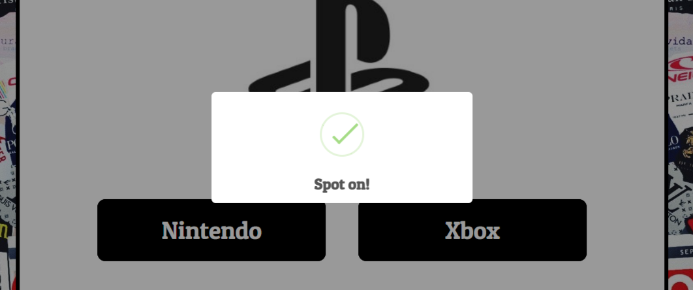

# Brand Logo Quiz

The Brand Logo Quiz is a fun and interactive quiz game to test the user's general brand logo knowledge. The user is given 8 randomised questions to answer and 4 choices to choose from. Correct answers are awarded 25 points while incorrect answers earn 0 points. When the game is completed, the user's final score is displayed and they are given two options to redirect home or to restart the game again. Developed by programming languages HTML, CSS, and Javascript.

## Features 

### Existing Features

- __Home Menu__
  - A full responsive home menu with the play button in the center. 
  - When user moves their cursor over the button, a rainbow moving glow effect occurs.

- __Question Page__

  - A complete responsive question page that runs across 8 questions.
  - A question counter tells the user which question they're on and how many are left.
  - A progress bar underneath also helps visualise it.
  - A score counter is on the top right corner and will display and add score points if user gets the correct answer.
  - The logo sits in the center and four choices are beneath for the user to choose.

- __End Page__

  - User has reached the end of the game and their score gets tallied up.
  - They are given two buttons to redirect them home or to play the game again.

- __Background Image__

  - This image was chosen as the background for its playful and colourful atmosphere.

## Technology Used

* HTML, CSS & Javascript programming languages
* [Google Fonts](https://fonts.google.com/) - Patua One Style
* [Gitpod](https://www.gitpod.io/) - Cloud development environment
* [GitHub](https://github.com/) - Repositories
* [Ui.Dev](https://ui.dev/amiresponsive) - Website on different screens
* [Sweetalert2](https://sweetalert2.github.io/) - Correct and incorrect answers alert

## Testing 

  - Testing was carried out by Chrome DevTools to ensure the website had the appropriate scaling for different screens and for testing code in console.
  - Game was tested to ensure the user would be given the appropriate message alerts for correct and incorrect answers.
  - Game was tested to ensure the appropriate points were given for correct and incorrect answers. It was also tested if the scores added up correctly and was saved towards the end.
  - Game was tested to ensure the user was informed of the appropriate information about what question number they are currently in. It was also tested if the question counter was fully functional.
  - Game was tested to ensure the questions were randomised as desired.

  - Lighthouse
    - [Lighthouse](https://chrome.google.com/webstore/detail/lighthouse/blipmdconlkpinefehnmjammfjpmpbjk?hl=en)
      

### Validator Testing 

- HTML
  - No errors were found when passing through the official [W3C validator](https://validator.w3.org/)

- CSS
  - No errors were found when passing through the official [(Jigsaw) validator](https://jigsaw.w3.org/css-validator/)

- Javascript
  - No errors were found when passing through the official [JSHint](https://jshint.com/)

### Bugs Encountered & Resolved

[Sweet Alert bug](assets/images/screenshots/font-size-bug.png)
  - Sweet alert could not function properly.
  - Fixed by removing font-size: 62.5% from * element to html element.

[Object Image bug](assets/images/screenshots/image-bug.png)
  - The image url value in the questions object would display as a string for each question.
  - Fixed this issue by assigning the question property to the src property of an element of image type.
  - Changing the 

 into .
  - Inputting the src class with the first image url of the first question.

## Deployment

The following actions were followed to publish this page to GitHub Pages from its [GitHub repository](https://github.com/IanaLois/Brand-Logo-Quiz):

1. Choose **Settings** from the menu choices towards the top of the page.
2. Go to the **GitHub Pages** section.
3. Under the **Source** section, pick **Main Branch** from the drop-down option.
4. After choosing Main Branch, the page is automatically updated, indicating that the website has been deployed.
5. Return to the **GitHub Pages** area to obtain the link to the deployed website.

## Credits 

### Content 

  - The core code was adapted from a YouTube tutorial, incorporating modifications. [James Q Quick](https://www.youtube.com/watch?v=rFWbAj40JrQ&list=PLB6wlEeCDJ5Yyh6P2N6Q_9JijB6v4UejF&index=1)
  - The core code for the alert messages were taken from [Sweetalert2](https://sweetalert2.github.io/)

### Media

The following logos used in this project were taken from multiple sources:

  - [Logo One](https://media.graphassets.com/PdRpmfEjRWyXsmF3Z4Ex)
  - [Logo Two](https://www.logolynx.com/images/logolynx/18/18e88c1fad4e38a5abd0e2945b793a13.jpeg)
  - [Logo Three](https://logodix.com/logo/10086.png)
  - [Logo Four](https://media.designrush.com/inspiration_images/288867/conversions/PS2_9661432b7934-mobile.jpg)
  - [Logo Five](https://1000logos.net/wp-content/uploads/2019/04/Jollibee-Logo-1996.jpg)
  - [Logo Six](https://logowik.com/content/uploads/images/t_discord-new-black4590.jpg)
  - [Logo Seven](https://quizbash.com/assets/img/games/logo-vansv-r.jpg)
  - [Logo Eight](https://1000logos.net/wp-content/uploads/2017/08/Color-Dunkin-Donuts-Logo.jpg)